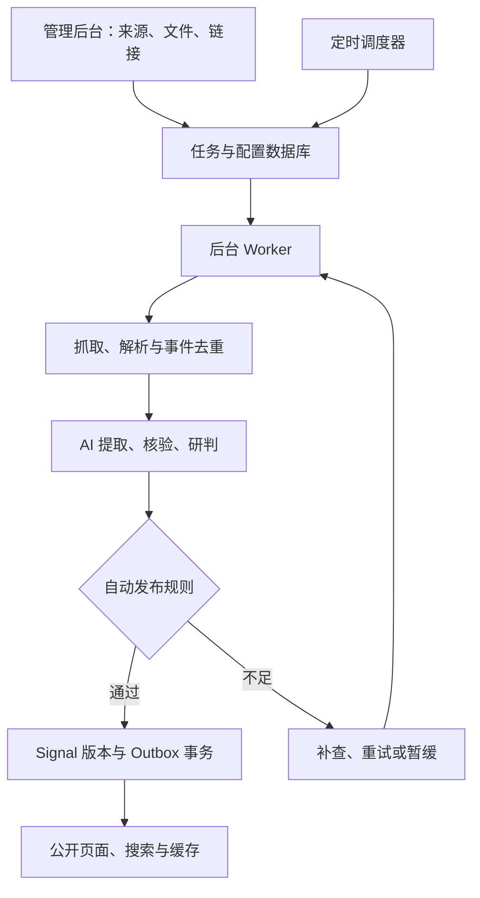

# HZense AI 自主 Signal 采集、研判与发布设计

- 版本：1.0.1
- 日期：2026-09-12
- 状态：设计提案，待工程实施；文档提交不代表功能上线。
- 范围：管理员网页配置 AI、自动/手动采集、定时任务、文件与链接导入、AI 研判、自动入库发布及更正。

本文是 [主设计文档](DESIGN.md#19-ai-自主采集与研判) 的技术细化；产品范围以主设计为入口，当前实施状态见 [进度看板](PROGRESS.md)。

## 1. 目标与决策

建立无需逐条人工审核的内容生产系统：资料进入后，自动提取事件、核验证据、生成中文研判，通过机器规则后直接发布。证据不足时自动补查、重试或暂缓，不创建必经的人工审批队列。

用户已明确要求全自动内容生产。现有架构文档中“采集不得绕过人工审核”的内容策略，在本功能实施范围内由自动证据和发布规则替代。工程代码、数据库迁移和权限配置仍遵循项目发布规范；日常内容不创建 GitHub PR、不触发整站部署。

核心决策：

1. 三种入口共用流水线：来源采集、文件上传、链接提交。
2. 手动运行与定时运行共用执行器；关闭浏览器不影响任务。
3. AI 通过服务器端 API 接入，提取、核验、研判分阶段调用；访客阅读使用已保存结果。
4. Signal 迁移为 PostgreSQL 权威数据，Git 保留代码、Taxonomy 和基线策略；网页编辑的运行配置在数据库版本化保存。
5. 发布采用显式 `published` 状态、不可变内容版本和事务 Outbox，支持自动更正与撤回。
6. 不用模型自报的置信度替代证据，不通过降低事实要求填满每日数量。

## 2. 当前基线与本次变化

| 项目        | 当前实现                      | 目标                                 |
| ----------- | ----------------------------- | ------------------------------------ |
| Signal 来源 | Seed YAML、人工组织的候选材料 | 持续采集及管理员导入                 |
| 公开条件    | Seed 中 reviewed 或 accepted  | 数据库发布版本显式 published         |
| 事实与研判  | 编辑处理；Daily 为确定性模板  | AI 提取、证据核验与中文分析          |
| 内容上线    | Git 提交后部署                | 数据库提交、索引同步和缓存更新       |
| AI 设置     | 本功能尚未接入                | 管理后台配置连接、模型、提示词及预算 |
| 运行方式    | 内容脚本及现有 Daily 工作流   | 持久化任务、手动运行和时区调度       |

参照 [架构](TECHNICAL_ARCHITECTURE.md)、[信息模型](INFORMATION_MODEL.md)、[工程规范](ENGINEERING_STANDARDS.md)、[进度](PROGRESS.md) 和 [Daily 契约](CONTINUOUS_DAILY.md)。历史文档中的生产检查点不能作为当前部署证明；实施前重新核对 main 与实际环境。

本阶段完成 Signal 自动生产。Daily/Weekly/Insights 的无人审核发布是后续独立扩展；本提案不暗中修改现有 Daily 选材和发布门禁。

## 3. 总体架构

继续使用 Next.js、TypeScript、PostgreSQL 和 Drizzle。建议新增逻辑模块 `packages/ai`、`packages/ingestion` 与独立 Worker 入口；具体目录在实施时核对现有包边界。

初版采用 PostgreSQL 持久化任务表和短时分步 Worker。调度器只投递到期任务，不在一次 HTTP 请求里完成整站采集。部署前验证 Worker 的运行时长、并发和续跑能力；无法满足时使用独立托管 Worker，不依赖网页请求存活。队列领取使用短事务和 SKIP LOCKED，模型与网络调用发生在事务之外。

## 4. 管理后台

后台仅对认证管理员开放；首版 owner-only，使用服务端固定身份允许列表。隐藏菜单不构成鉴权，所有读取密钥配置、上传、任务和写入 API 均验证会话与授权。

| 路由建议             | 功能                                        |
| -------------------- | ------------------------------------------- |
| `/admin`             | 最近运行、领域覆盖、费用、失败与发布统计    |
| `/admin/ai`          | 连接配置、模型能力、连接测试、密钥替换      |
| `/admin/ai/profiles` | 提取/核验/研判模型、提示词与参数版本        |
| `/admin/sources`     | 来源注册、语言、领域、频率与采集状态        |
| `/admin/tasks`       | 创建任务、立即运行、定时、暂停、恢复        |
| `/admin/imports`     | 文件和链接批量导入、解析预览、逐项结果      |
| `/admin/runs/[id]`   | 分步进度、暂缓理由、重试、费用、关联 Signal |
| `/admin/signals`     | 发布历史、证据、更正、可选手动撤回          |

移动端支持单列配置表单、分步导入和运行状态查看。手动撤回属于可选管理工具，不是内容发布前置环节。

### 4.1 AI 连接与任务配置

每个连接保存名称、协议适配器、HTTPS Base URL、密钥引用、模型 ID、能力声明、超时、并发、重试与费用配置。优先实现一种稳定协议适配器及兼容接口，其他服务商按实际协议增加适配器；不假定所有兼容服务都支持相同的结构化输出或工具调用。

支持获取模型列表和手工输入模型名。连接测试执行最小请求并显示延迟与脱敏错误；Schema 和能力测试独立于“连接成功”。测试、小样本试运行也计入预算。

任务 Profile 分别绑定提取、核验、研判模型和提示词版本。管理员可调整分析风格、长度、领域、语言和模型参数；系统证据规则、权限和输出 Schema 不能被普通提示词覆盖。能力不足的模型不得被配置给必要阶段。

模型调用记录实际模型、配置版本、输入/输出指纹、token 用量、估算费用、耗时和失败分类。不承诺模型输出逐字可重现；通过持久化结果重放已完成步骤。

API Key 由服务端信封加密保存，根密钥放在部署密钥系统，与数据库分离，记录 key version 并支持轮换。页面保存后只显示掩码，不提供读取明文接口；日志、导出和错误响应不得包含密钥。禁用连接会阻止新调用，撤销密钥立即生效，运行快照不能恢复已撤销凭据。

### 4.2 采集任务

任务包含名称、启用状态、来源集合、领域/关键词、语言、回看范围、最大文档数、AI Profile、发布策略、时区、预算和并发限制。模式为 `auto_publish`（默认）或 `preview_only`；预览模式不会产生公开发布或搜索写入。

操作：立即运行、暂停未来调度、恢复、停止本次运行、重试失败项。每次运行保存不可变配置快照，后续编辑只影响新运行。已发布内容不因停止任务而删除；取消信号在阶段之间和发布事务前检查。

## 5. 三类采集入口

### 5.1 自动来源与搜索发现

来源注册字段：稳定 ID、官方/研究/媒体等类别、允许域名、协议适配器、语言、Taxonomy ID、采集游标、ETag/Last-Modified、频率、来源归属组、访问规则和正文保留策略。

优先 RSS/API，再网页列表和站点地图；搜索用于补充发现。支持十个一级领域的来源与检索词映射。首批选择少量高质量来源跑通全链路后扩展，不把“存在 Taxonomy”当作“已经覆盖”。来源运行配置保存在数据库；Git 中来源 Seed 仅作为初始化输入，切换后禁止双向双写。

新发现域名可按机器规则临时抓取与评估；不自动赋予“官方/高可信”身份。转载稿、新闻通讯社分发和同一原文引用通过证据归属分组，避免误计独立来源。

增量抓取保存游标且配合有界回看，失败不会跳过尚未持久化的文章。提供每领域来源数、成功抓取数、新鲜事件数、发布数和最后成功时间；零发布是允许结果。

### 5.2 文件上传

支持 PDF、DOCX、Markdown、TXT、HTML、CSV、XLSX；扫描 PDF 和 PNG/JPEG 走 OCR。旧 DOC 格式需先转换，首版不运行 Office 宏、不执行表格公式、不解析压缩包内任意文件。

流程：认证获取短期上传凭证 → 上传私有对象 → 服务端验证大小/MIME/文件签名/哈希 → 隔离解析 → 提取候选。文件名和 MIME 均视为不可信；解析器限制内存、CPU、页数、解压体积和外部网络访问。

建议初始限制：单文件 25 MB、单批 20 文件、每文档最多 300 页，均由服务器强制执行并可按环境调整。OCR 低质量或表格上下文缺失时暂缓相关事实；保留页码、段落、sheet/单元格定位。

一份文件可产生多个事件，多份文件可支持同一事件。上传时间不替代发生时间。原始文件默认私有；默认发布模式自动查找公开佐证，只发布可由公开证据支持的事实与研判，私有附件内容、文件名和签名 URL 不出现在公开响应中。无公开佐证时自动暂缓，不要求逐条人工审核。直接公开私有文件内容属于未来独立功能。

### 5.3 链接提交

支持单链接和逐行批量链接，建议初始每批 100 条。提交返回 batch ID 和逐项状态，不等待整批完成。跟踪 URL、规范 URL、重定向链、抓取时间、正文哈希与来源关系。

不绕过登录或付费访问限制。抓取失败可自动寻找替代证据，或由用户补充文件；首页、栏目页和动态榜单不能直接作为某一历史事实的证据。

### 5.4 外部输入边界

链接抓取和自定义 AI Endpoint 共用出口控制：仅允许规定的 HTTPS 端口，拒绝 URL 凭据、回环、私网、链路本地和云元数据地址；初始 DNS、每次重定向与实际连接目标都验证，防止 DNS rebinding。API Key 不随跨域重定向转发。模型无任意网络权限，工具调用由服务端策略执行。

网页、文件和 OCR 文本均为资料，不是指令；不能修改系统提示词、工具权限、发布规则或数据库。HTML 清理，Markdown 渲染禁用危险 HTML，禁止直接执行模型返回的 SQL/代码。

## 6. AI 流水线与发布规则

### 6.1 阶段输出

| 阶段     | 输出与约束                                                     |
| -------- | -------------------------------------------------------------- |
| 解析     | 原文片段、位置、语言、内容指纹                                 |
| 提取     | 独立事件、主体、动作、日期建议、数字与引用                     |
| 去重     | 文档哈希/规范 URL 精确去重；事件主体、动作、日期和语义候选匹配 |
| 分类     | 现有 Taxonomy ID、实体匹配；未知关联不强行填充                 |
| 核验     | claim 与 evidence 对应、来源独立性、冲突、时间精度             |
| 研判     | 事实摘要、为什么重要、影响对象、历史关系、后续观察、不确定性   |
| 发布检查 | Schema、引用覆盖、数值一致性、时间、公开权限、规则结果         |

提取、核验、研判分次调用。核验重新读取证据而非只判断写作结果；可用不同模型，但模型一致不等于事实成立。第一版使用现有全文搜索查询历史上下文；Embedding/pgvector 可随后增强，不能把“安装 pgvector”当成语义检索已经可用。

### 6.2 自动判定

| 情况                                 | 处理                                                                |
| ------------------------------------ | ------------------------------------------------------------------- |
| 可定位的官方公告支持“发布方宣布了 X” | 可按归属表述发布；性能或影响结论仍需额外证据/分析标记               |
| 普通媒体事实                         | 默认至少两个独立来源支持核心断言                                    |
| 重大、争议、指控                     | 至少两个独立来源，自动尝试第三来源和相关方回应；无法满足则补查/暂缓 |
| 转载同一稿件                         | 算一个证据来源                                                      |
| 传闻、计划、预测                     | 显式保留类别和归属，不写成已完成事件                                |
| 关键日期、数字或事件身份冲突         | 补查；超限暂缓                                                      |
| 新证据支持既有事件                   | 关联或发布修订版本，不新建重复 Signal                               |
| 已确认重复/无关材料                  | rejected，保留原因                                                  |

所有关键事实必须关联可定位证据；缺引用、私有信息泄漏、无效日期等为硬失败。重要性/强度/置信度/新颖度保留编辑模型估计与版本，但不单独决定发布。中文输出不等于中文信源，原始来源语言真实保留。

建议候选最多补查三轮，分时重试；达到上限进入 deferred，记录下次可重启条件，避免无限消耗预算。事实质量仍可能出错，靠证据追溯、评测和自动更正降低误报，不能宣称自动校验保证真实。

### 6.3 时间与事件身份

分别保存 occurred_at、source_published_at、captured_at、published_at、updated_at、date_precision 和 date_basis。只知道日期时保留天级精度；兼容旧零点字段时明确其为存储约定。历史补录可进入 Signals，不因近期上传成为当天新闻。

同一事件多报道合并；签约、交割、投产等不同阶段分别建事件并关联。语义匹配只产生候选关系，不能仅靠向量相近强行合并。并发发布由稳定事件键及唯一约束防重；不确定身份先暂缓。

## 7. 数据模型与状态

以下为逻辑实体，实施前盘点现有 Drizzle Schema；优先扩展已有 Signal、Source、Entity、Search 表，不重复建立冲突的权威数据。

| 实体                          | 关键字段/约束                                                     |
| ----------------------------- | ----------------------------------------------------------------- |
| ai_connections / secrets      | adapter、endpoint、secret_ref、key_version、enabled；密钥不可公开 |
| ai_profiles / policy_versions | 阶段模型、提示词、Schema、预算与策略版本；不可变历史              |
| ingestion_tasks / schedules   | 配置版本、时区、next_run_at、并发策略                             |
| ingestion_runs / run_steps    | 触发方式、快照、lease、fencing token、attempt、checkpoint、reason |
| documents / import_items      | origin、hash、对象引用、访问级别、解析位置、批次项状态            |
| events / candidates           | 事件键、原始线索、分类、处理状态、正式 Signal 关联                |
| evidence / claims             | 来源身份、公开性、片段位置、内容指纹、支持/冲突关系               |
| signals / signal_versions     | 稳定 ID、current_version、状态、事实、研判、引用与修订理由        |
| model_calls / usage_ledger    | 模型和输入版本、用量、费用预留/结算、重试原因                     |
| publication_outbox            | signal_id、version、事件类型、重试与消费状态，唯一幂等键          |
| audit_events                  | 配置修改、运行触发、发布、更正和撤回，脱敏不可变记录              |

候选状态：queued → processing → verified → published；异常分支为 retry_wait、deferred、rejected 或 cancelled。阶段进度单独存在 run_steps，不把运行失败混入内容公开状态。

正式 Signal 状态：unpublished、published、withdrawn、archived。内容版本不可覆盖；更正创建新版本并更新 current_version。published 的新草稿核验失败时继续展示旧有效版本，除非证据足以触发撤回。

## 8. 调度、重试与费用

支持每 N 分钟、每天、每周和高级 cron；保存 IANA 时区，默认 Europe/Berlin。后台心跳扫描 next_run_at，数据库唯一键 `(task_id, scheduled_for)` 保证重复触发只产生一轮。调度精度目标为分钟级，不承诺硬实时。

夏令时规则：本地时刻不存在时顺延到第一个有效时刻；重复时刻只执行一次，并在配置页展示接下来五次运行时间。每 N 分钟模式按实际经过时间计算。停机后默认合并补跑一次并使用有界回看，不重放所有历史时隙。

任务级并发默认 1；重叠调度记为 skipped_overlap。暂停影响未来调度；停止本次运行设置 cancellation 并在发布事务前复查。Worker 租约超时可重领，fencing token 拒绝过期 Worker 提交。领取事务不跨模型调用。

429/网络错误按 Retry-After 或带抖动退避；认证失败停用对应连接的新调用；解析/Schema 错误有界修复；确定无关材料不重试。任何重试复用已成功的中间产物。模型故障可切换预配置兼容连接，不静默换成能力不足模型。

调用前原子预留费用，结束按实际用量结算；设请求 token/检索/OCR 上限、单任务和每日额度。重试与连接测试计费。未知价格的连接要求配置保守估算，界面标记估算值；实际账单以服务商为准，预算控制不能保证外部账单绝对零超额。达到预算暂停后续付费步骤，次日或额度调整后恢复。

## 9. 发布、搜索与更正

发布服务在单一事务中验证目标状态、任务取消标记、最新有效租约、策略版本和事件唯一性，写 Signal 版本与 Outbox。事务失败不会出现半条公开内容。

Outbox 消费者幂等更新现有 search_documents 派生投影，然后触发缓存失效。消费按 Signal 版本单调推进，旧事件不能覆盖新更正。列表/详情查询已发布版本；搜索查询同时确认当前公开状态，防止撤回内容在索引延迟期间继续泄漏。缓存设有限 TTL，失效重试并监控；正常情况下发布至页面/搜索可见目标为 60 秒内。

现有全量 Seed 搜索同步器必须增加数据归属与增量契约，不能删除或覆盖数据库权威 Signal。sitemap、专题/实体关联、SEO、Signal 详情及 Daily 消费者都切换统一查询接口。

更正扫描关注原文变化、新增证据及来源撤稿。仅链接失效不自动判定事实错误；确认核心事实被推翻则生成撤回记录和 Outbox。公开页面保留修订说明及稳定 URL；正文下架后可展示简短撤回说明，不保留有害或私有原文。

## 10. 权限与运行配置

Web 公共 Reader 只读取公开视图；后台配置、采集 Worker、发布服务、索引消费者使用分离的受限数据库身份。发布身份不能执行 DDL；管理密钥的能力不授予公共网站 Reader。精确表/列/函数权限随实现迁移评审，不能复用 Migrator 或静默放宽现有 Runtime ACL。

管理 API 防 CSRF、校验 Origin、限制速率并记录审计。短期上传凭证限制对象键、大小和归属；对象私有，下载需授权。日志只含 ID 与脱敏错误，模型原始输出和文档内容按私有材料管理。

上线配置清单：管理员身份及会话、模型连接、密钥加密根、私有对象存储、Worker 与调度认证、独立数据库角色、来源集合、预算、保留期、监控告警。模型服务商/OCR/搜索服务商及精确依赖版本在实施阶段通过实际能力与成本测试选择，本设计不虚构已配置资源。

## 11. 迁移与回滚

1. 盘点生产 Schema、引用与现有搜索同步；按工程规范新增迁移和角色，不修改历史迁移。
2. 引入统一 SignalRepository，先维持 Seed 实现；Preview 使用隔离数据，不连接生产写入。
3. 幂等回填历史 Signal，保留 ID、日期、来源与关联。原公开 reviewed/accepted 映射 published，并标记 legacy/imported，不伪称已通过新 AI 规则。
4. 校验数量、ID 集、引用、正文与搜索 parity；明确切换时间点并禁止 Seed Signal 双写。
5. 切换数据库读取和发布，更新 Daily 读取适配器以接受已发布 Signal；保留其已有时间窗口和人工发布要求，Daily 自动发表另做功能。
6. 开启首批自动任务，完成真实端到端验收再扩展来源。

停止自动生产时暂停调度和新发布，保留数据库和已发布版本。切换后的回滚优先使用兼容数据库的前一应用版本；不能直接回退旧 Seed 页面导致新内容消失。灾难恢复使用验证过的数据库/对象备份并重放 Outbox；导出的 YAML/Markdown 只是可移植副本，不自动成为写入源。

## 12. 验收与实施拆分

| 阶段          | 交付                                        | 验收                                               |
| ------------- | ------------------------------------------- | -------------------------------------------------- |
| A：基础与后台 | 数据契约、认证、AI 连接/配置页、密钥存储    | 未授权访问被拒；密钥无回显；测试调用有预算和审计   |
| B：统一导入   | 文件、OCR、批量链接、来源适配器、手动任务   | 一文多事件、多文同事件、分页溯源、失败项可重试     |
| C：AI 处理    | 提取、独立证据核验、中文研判、发布规则      | 无证据数字被拦；转载不重复计数；提示注入无权限效果 |
| D：数据库发布 | 历史迁移、统一读取、版本、Outbox、搜索/缓存 | 并发重跑无重复；崩溃恢复无半发布；撤回搜索不可见   |
| E：定时与运营 | 时区调度、暂停/取消、预算、自动更正、监控   | DST/停机补跑/租约过期测试；关闭网页后持续运行      |

各阶段按依赖拆成短期分支 PR，不预占实际 PR 编号。B/C 可在预览模式积累结果，D/E 完成后才声称自动发布上线。

测试集必须覆盖真实正例和暂缓样本、错误时间、混合事件、转载、私有资料、OCR 错读、跨域重定向、恶意文件、取消与发布竞争、Worker 崩溃、索引故障和预算并发。零发布属于正常完成状态。质量评测报告分别记录关键事实支持率、误合并率、错发率、领域覆盖和费用，不用单一模型自评分替代。

最终验收：三类入口均可在无人逐条审核下完成采集至发表；每条内容可追溯到证据、配置及模型版本；断点恢复不重复发表；自动更正能同步页面和搜索。工程验证可使用人工标注评测集，这不是日常发布的人工审批环节。

## 13. 后续扩展与文档同步

后续可接 Daily/Weekly 自动汇编、混合搜索、趋势分析和 RAG。Signal 首版不承诺同时完成这些模块。上线时同步 TECHNICAL_ARCHITECTURE、INFORMATION_MODEL、PROGRESS、部署手册和现有 Seed/搜索/Daily 契约，记录真实验证证据；本次同步主设计、架构入口和进度看板；没有执行应用代码、迁移或生产配置变更。

参考实现依据：

- [PostgreSQL SELECT / SKIP LOCKED](https://www.postgresql.org/docs/current/sql-select.html)：用于多消费者队列领取，不替代应用幂等和租约。
- [Vercel Cron 管理](https://vercel.com/docs/cron-jobs/manage-cron-jobs)：触发需结合并发锁与幂等；业务时区调度保存在应用数据库。
- [现有 Signal 读取](../apps/web/lib/seed-runtime.ts)、[Seed 校验](../packages/content/src/seed.ts)、[资料导入记录](content-intake/2026-09-11-datas/README.md)。
