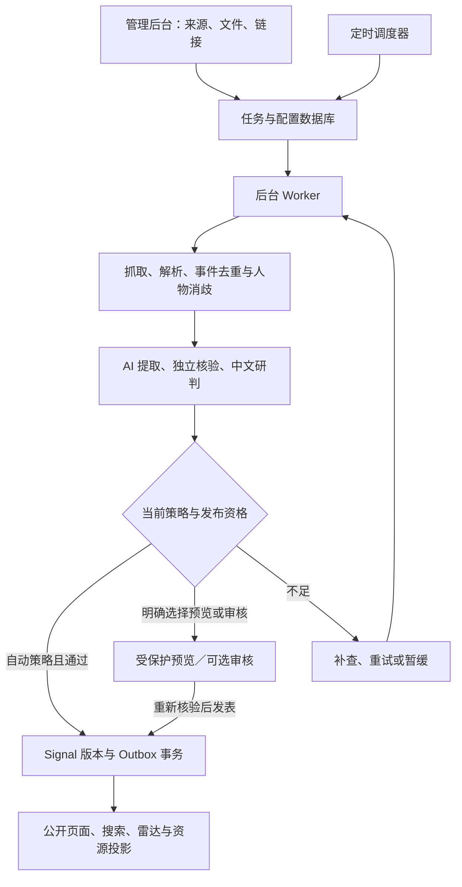

# HZense AI 自主 Signal 采集、研判与发布技术契约

- 版本：1.1.0
- 日期：2026-09-12
- 状态：整合后的设计提案，待工程实施；文档提交不代表功能、迁移或生产开关已经上线。
- 范围：管理员网页配置 AI、自动／手动采集、定时任务、文件与链接导入、AI 研判、人物证据、自动入库发布及更正。
- 整合基线：[初版专项契约（原 PR #64 初版）](https://github.com/hzense/tech-intelligence-hub/blob/b5a0045f1c7e7591fe04d49409dd5148a10d87aa/docs/AUTONOMOUS_SIGNAL_PIPELINE.md)，来源提交 b5a0045f1c7e7591fe04d49409dd5148a10d87aa。

## 0. 文档权威与整合范围

[DESIGN.md](DESIGN.md) 是产品总纲；[SIGNAL_FIRST_REDESIGN.md](SIGNAL_FIRST_REDESIGN.md) 定义新版公开页面、人物硬约束、评分、专题洞察及历史迁移；本文定义生产流水线的专项技术契约。[PROGRESS.md](PROGRESS.md) 记录实施状态，[INFORMATION_MODEL.md 第 40 节](INFORMATION_MODEL.md#40-postgresql-物理数据库设计) 仍只描述已经实现的物理结构。

整合设计保留初版专项契约的完整 AI 连接、能力测试、模型 Profile、增量采集、文件／OCR、调度、费用、自动更正与安全能力，并明确替换以下旧方向：

| 原专项设计                                             | 本次整合后的契约                                                           |
| ------------------------------------------------------ | -------------------------------------------------------------------------- |
| Signal 三入口默认自动发表                              | 保留；新增可选 review_required 不改变默认，工程试运行仍可使用 preview_only |
| 文件、表格与 OCR 统一导入                              | 保留全部首版必需范围；未配置解析／OCR 能力表示未完成验收，不是自动延期     |
| 旧 reviewed／accepted 直接映射 published + legacy      | 保留旧可访问性，但只有补齐新版人物与证据资格后才能升级为新版有效 published |
| Daily 继续消费 Signal，未来扩展 Daily／Weekly 自动汇编 | 取消新增生产与消费者适配方向；仅保留历史归档、旧链接和渲染兼容             |
| Signal 证据与实体引用                                  | 扩展为不可变版本上的人物／组织角色与证据关系，并加入批次来源多对多溯源     |
| 配置快照后续编辑只影响新运行                           | 普通生成参数维持快照；当前安全开关、来源／连接撤销、取消和发布权限即时优先 |

专题洞察是新的分析产品，默认每周运行及手动触发的产品要求见主稿；其默认发表策略尚待确认，不由 Signal 的自动发表默认值推导。本文不改动现有生产设置。

## 1. 目标与决策

建立无需逐条人工审核的 Signal 生产系统：资料进入后，自动提取事件、核验证据与人物关系、生成中文研判，通过机器规则后直接发布。证据不足时自动补查、重试或暂缓，不创建必经的人工审批队列。

Signal 的来源采集、文件上传、链接提交三种入口均默认 auto_publish；日常内容不创建 GitHub PR、不触发整站部署。preview_only 用于工程试运行或管理员明确选择的预览；review_required 是可选运行策略，不是新增默认。工程代码、数据库迁移和权限配置仍遵循项目发布规范。

核心决策：

1. 三种入口共用流水线与发布服务，不为手动上传建立绕过证据校验的直接入库路径。
2. 手动运行与定时运行共用执行器；服务器确认接收并提交的任务不依赖浏览器持续打开。
3. AI 通过服务器端 API 接入，提取、核验、研判分阶段调用；访客阅读使用已保存结果。
4. Signal 及人物／组织关系迁移为 PostgreSQL 权威数据，Git 保留代码、Taxonomy 和基线策略；网页编辑的运行配置在数据库版本化保存。
5. 发布采用显式 published 状态、不可变内容版本和事务 Outbox；新版公开 Signal 至少关联一位有证据的业界人物。
6. 不用模型自报的置信度替代证据，不通过降低事实或人物要求填满每日数量。
7. 自动更正与首次发表共享资格规则；经授权的撤回／屏蔽保持独立安全通道，共享版本及投影一致性，但不被暂停新增发表的开关阻断。

## 2. 当前基线与本次变化

| 项目        | 当前实现                        | 目标                                               |
| ----------- | ------------------------------- | -------------------------------------------------- |
| Signal 来源 | Seed YAML、人工组织的候选材料   | 持续采集及管理员文档／链接导入                     |
| 公开条件    | Seed 中 reviewed 或 accepted    | 新版数据库发布版本显式 published，且人物／证据合格 |
| 事实与研判  | 编辑处理；旧 Daily 为确定性模板 | AI 提取、独立证据核验与中文分析                    |
| 内容上线    | Git 提交后部署                  | 数据库提交、索引同步和缓存更新                     |
| AI 设置     | 本功能尚未接入                  | 管理后台配置连接、模型、提示词及预算               |
| 运行方式    | 既有内容脚本及 Daily 工作流     | 持久化任务、手动运行、批次与时区调度               |

参照 [架构](TECHNICAL_ARCHITECTURE.md)、[信息模型](INFORMATION_MODEL.md)、[工程规范](ENGINEERING_STANDARDS.md) 和 [进度](PROGRESS.md)。历史生产检查点不能作为当前部署证明；实施前重新核对 main 与实际环境。

Daily／Weekly 不再作为新产品生产，也不再建设其数据库 Signal 消费适配器。现有内容及 [历史 Daily 契约](CONTINUOUS_DAILY.md) 只在归档兼容范围保留；现有任务停用时点遵循主稿迁移步骤，不能在设计阶段直接删除。

## 3. 总体架构

继续使用 Next.js、TypeScript、PostgreSQL 和 Drizzle。生产模块包括 packages/ai、packages/ingestion 与独立 Worker 入口；热点、趋势、组织活跃度和专题编排边界见主稿，不另建一套内容权威。

初版采用 PostgreSQL 持久化任务表和短时分步 Worker。调度器只投递到期任务，不在一次 HTTP 请求里完成整站采集。部署前验证 Worker 的运行时长、并发和续跑能力；无法满足时使用独立托管 Worker。队列领取使用短事务和 SKIP LOCKED，模型与网络调用发生在事务之外。

## 4. 管理后台

后台仅对认证管理员开放；首版 owner-only，使用服务端固定身份允许列表。隐藏菜单不构成鉴权，所有读取配置、上传、任务和写入 API 均验证会话与授权。

| 路由建议                 | 功能                                           |
| ------------------------ | ---------------------------------------------- |
| /admin                   | 最近运行、领域覆盖、费用、失败与发布统计       |
| /admin/ai                | 连接配置、模型能力、连接测试、密钥替换         |
| /admin/ai/profiles       | 提取／核验／研判模型、提示词与参数版本         |
| /admin/sources           | 来源注册、语言、领域、频率、准入和采集状态     |
| /admin/tasks             | 创建任务、立即运行、定时、暂停、恢复及更正扫描 |
| /admin/imports           | 文件和链接混合批量导入、预览、生成并发布       |
| /admin/imports/[batchId] | 上传／解析／生成／发布／同步的逐项结果与重试   |
| /admin/runs/[id]         | 分步进度、暂缓理由、重试、费用、关联 Signal    |
| /admin/signals           | 发布历史、证据、更正、可选审核及手动撤回       |

移动端支持单列配置表单、分步导入和运行状态查看。手动撤回是管理工具，不是自动发表前置环节；专题与资源管理页面见主稿。

### 4.1 AI 连接与任务配置

每个连接保存名称、协议适配器、HTTPS Base URL、密钥引用、模型 ID、能力声明、超时、并发、重试与费用配置。优先实现一种稳定协议适配器及兼容接口，其他服务商按实际协议增加适配器；不假定所有兼容服务支持相同的结构化输出或工具调用。

支持获取模型列表和手工输入模型名。连接测试执行最小请求并显示延迟与脱敏错误；Schema 和能力测试独立于“连接成功”。测试、小样本试运行也计入预算。

任务 Profile 分别绑定提取、核验、研判模型和提示词版本。管理员可调整分析风格、长度、领域、语言和模型参数；系统证据规则、权限和输出 Schema 不能被普通提示词覆盖。能力不足的模型不得被配置给必要阶段；OCR、工具调用及结构化输出按实际阶段需要验证。

先创建 Run／Generation ID 再调用模型。每次调用记录实际模型、配置／提示词版本、输入／输出指纹、token 用量、估算费用、耗时和失败分类。不承诺模型输出逐字可重现；通过持久化结果重放已完成步骤。

API Key 由服务端信封加密保存，根密钥放在部署密钥系统，与数据库分离，记录 key version 并支持轮换；支持轮换不表示本次执行轮换。页面保存后只显示掩码，不提供读取明文接口；日志、导出和错误响应不得包含密钥。禁用连接阻止后续调用，撤销密钥立即生效，运行快照不能恢复已撤销凭据。

### 4.2 采集任务与发布策略

任务包含名称、启用状态、来源集合、领域／关键词、语言、回看范围、最大文档数、AI Profile、发布策略、时区、预算和并发限制。Signal 三入口默认为 auto_publish；preview_only 不产生公开发布或搜索写入；管理员明确选择 review_required 时才进入审核队列。

手动导入的“生成并发布”明确采用本批 auto_publish，合格事件不再逐条二次确认；选中文件或拖入浏览器本身不立即发表。批次 UI、操作与限制遵循 [主稿第 7.4 节](SIGNAL_FIRST_REDESIGN.md#74-文档与超链接批量导入正式功能)。生产总开关启用属于部署配置，不因默认策略写入本文就已经开启。

操作包括立即运行、暂停未来调度、恢复、停止本次运行、重试失败项。每次运行保存不可变配置快照；普通模型参数编辑影响新运行。当前发布总开关、改为预览、来源／模型连接撤销和取消对运行中的后续步骤立即生效，发表前必须重新检查。更宽松的新策略不能把原 preview_only 或 review_required 任务静默升级为自动发表，需明确另行发表操作。

已发布内容不因停止任务而删除。取消在阶段之间及发布事务前检查；已生成但未发表的合格结果可复用，实际发表仍重新检查当前策略、证据与人物资格。

完成预览后明确点击发表，必须创建新的经授权 publication run／attempt 并关联旧生成结果，取得当前租约与 fencing token，再按当前策略核验；不能恢复已完成、取消或过期的旧任务权限。复用结果不等于复用发表授权，必要补证仍按预算执行。

## 5. 三类采集入口

### 5.1 自动来源与搜索发现

来源注册字段包括稳定 ID、官方／研究／媒体等类别、允许域名、协议适配器、语言、Taxonomy ID、采集游标、ETag／Last-Modified、频率、来源归属组、访问规则和正文保留策略。

优先 RSS／API，再网页列表和站点地图；搜索用于补充发现。支持现有十个一级领域的来源与检索词映射；以后随权威 Taxonomy 变更，不另建不一致的 Radar 分类。首批选择少量高质量来源跑通全链路后扩展，不把“存在 Taxonomy”当作“已经覆盖”。来源运行配置保存在数据库；Git 来源 Seed 仅作初始化输入，切换后禁止双向双写。

新发现域名可按机器准入规则临时抓取与评估；临时准入记录范围、有效期、预算和结果，并经过同一出口安全检查。允许抓取不自动赋予“官方／高可信”身份，也不直接满足发表资格。用户提交的未知域名链接进入此流程，不要求为每个链接手动注册来源。转载、新闻通讯社分发和同一原文引用通过证据归属分组，避免误计独立来源。

增量抓取保存游标且配合有界回看；只有本轮页面及解析结果已持久化才推进相应游标，失败不能跳过未保存文章。提供每领域来源数、成功抓取数、新鲜事件数、发布数、积压和最后成功时间；零发布是允许结果。来源覆盖与比较面板的趋势规则见主稿。

### 5.2 文件上传

首版必须支持 PDF、DOCX、Markdown、TXT、HTML、CSV、XLSX，以及扫描 PDF 和 PNG／JPEG OCR。旧 DOC 格式需先转换；不运行 Office 宏、不执行表格公式、不解析用户压缩包内任意文件。Office 文件内部结构仅由受限解析器按允许格式处理。

流程为认证获取短期上传凭证 → 上传私有对象 → 服务端验证大小／MIME／文件签名／哈希／归属 → 隔离解析 → 提取候选。文件名和 MIME 均不可信；解析器限制内存、CPU、页数、解压体积和外部网络访问。

文件／批次上限及逐项反馈使用主稿第 7.4 节的统一配置，不另设第二套默认值。OCR、表格解析与对应费用配置必须通过能力测试；未配置时界面明确拒绝相关类型并提示，但这表示首版验收未完成，不能将必需能力视为可延期扩展。OCR 低质量或表格上下文缺失时暂缓相关事实；保留页码、段落、sheet／单元格定位。

一份文件可产生零个或多个事件，多份文件可支持同一事件。上传时间不替代发生时间。原始文件默认私有；自动寻找公开佐证，只发表可由公开证据独立支持的事实与研判，私有附件内容、文件名、本机路径和签名 URL 不进入公开响应。无公开佐证时进入 needs_public_evidence，不要求逐条人工审核来替代证据。直接公开私有文件内容属于独立授权与引用发布流程，不在本功能隐含许可之内。

### 5.3 链接提交与批次

支持单链接和逐行批量链接，也支持与文件混合成批。提交返回 batch ID 和逐项状态，不等待整批完成；关闭浏览器后仅服务器已确认接收并提交的输入可继续处理。记录原始 URL、规范 URL、重定向链、抓取时间、正文哈希与来源关系。

不绕过登录或付费访问限制。抓取失败可自动寻找替代证据，或由用户补充文件；首页、栏目页和动态榜单不能直接作为某一历史事实的证据。文档中的链接只是发现线索，有界跟随，不无限递归抓取。

批次／输入项、文档版本、证据与 Signal 版本保持多对多溯源；跨批复用相同文件哈希前核验访问权限。同一 URL 内容变化形成新文档版本，同一事件的新证据关联既有 Signal，不能按输入项数量生成重复事件。

批次支持部分成功；输入项结果与去重后的生成／关联／发布／暂缓 Signal 数分别统计。仅重试失败项，保留成功中间结果和已发布内容；停止批次不自动撤回既有发表。多份文档共同支持的事件，只有证据足够才可发表。详细状态、预算、审计和同步提示遵循主稿第 7.4 节。

### 5.4 外部输入边界

链接抓取和自定义 AI Endpoint 共用出口控制：仅允许规定的 HTTPS 端口，拒绝 URL 凭据、回环、私网、链路本地和云元数据地址；初始 DNS、每次重定向与实际连接目标都验证，防止 DNS rebinding。API Key 不随跨域重定向转发。模型没有任意网络权限，工具调用由服务端策略执行。

网页、文件和 OCR 文本均为资料，不是指令；不能修改系统提示词、工具权限、发布规则或数据库。HTML 清理，Markdown 渲染禁用危险 HTML，禁止直接执行模型返回的 SQL／代码。原始资料仅发送给配置为允许处理该类资料的模型连接，后台明确提示外部处理范围。

## 6. AI 流水线与发布规则

### 6.1 阶段输出

| 阶段       | 输出与约束                                                               |
| ---------- | ------------------------------------------------------------------------ |
| 解析       | 原文片段、位置、语言、内容指纹                                           |
| 提取       | 独立事件、主体、动作、日期建议、数字与引用                               |
| 去重       | 文档哈希／规范 URL 精确去重；事件主体、动作、日期和语义候选匹配          |
| 分类与消歧 | 现有 Taxonomy ID、人物／组织匹配、角色；未知关联不强行填充               |
| 核验       | claim 与 evidence 对应、来源独立性、人物身份及事件关系、冲突、时间精度   |
| 研判       | 事实摘要、为什么重要、影响对象、历史关系、后续观察、不确定性             |
| 发布检查   | Schema、引用覆盖、数值一致性、时间、至少一位合格人物、公开权限、当前策略 |

提取、核验、研判分次调用。核验重新读取证据而非只判断写作结果；可用不同模型，但模型一致不等于事实成立。第一版使用现有全文搜索查询历史上下文；Embedding／pgvector 可随后增强，不能把“安装 pgvector”当作语义检索已经可用。

### 6.2 自动判定与人物资格

| 情况                                 | 处理                                                               |
| ------------------------------------ | ------------------------------------------------------------------ |
| 可定位的官方公告支持“发布方宣布了 X” | 可按归属表述；效果或影响结论仍需额外证据／分析标记，并满足人物资格 |
| 普通媒体事实                         | 默认至少两个独立来源支持核心断言                                   |
| 重大、争议、指控                     | 至少两个独立来源，自动尝试第三来源和相关方回应；不足则补查／暂缓   |
| 转载同一稿件                         | 算一个证据来源                                                     |
| 传闻、计划、预测                     | 显式保留类别和归属，不写成已完成事件                               |
| 关键日期、数字或事件身份冲突         | 补查；超限暂缓                                                     |
| 缺少有据的业界人物或身份有歧义       | 自动补查，仍不足则 needs_person_evidence，不附会 CEO 或虚构姓名    |
| 私有材料缺少独立公开佐证             | needs_public_evidence，资料原文不出现在公开内容中                  |
| 新证据支持既有事件                   | 关联或发布修订版本，不新建重复 Signal                              |
| 已确认重复／无关材料                 | rejected，保留原因                                                 |

所有关键事实必须关联可定位证据；缺引用、私有信息泄漏、无效日期等为硬失败。每个新版 published Signal 至少关联一个独立 Person ID，并在该 Signal 版本中保存事件角色、证据与核验状态。新闻记者署名不自动满足业界参与人物要求，公司出现不代表其 CEO 参与该事件。

人物—组织任职保存有效期和来源，区分事件当时与当前角色；不能把人物全部历史事件归给新雇主。组织活跃度只依据有据主体／参与关系，背景提及不计分。人物／组织详情和评分契约遵循主稿。

重要性／强度／置信度／新颖度保留模型估计与版本，但不单独决定发表。中文输出不等于中文信源，原始语言真实保留。模型只能提出有依据的评分分项，最终榜单由主稿的确定性评分规则计算。

候选建议最多补查三轮，分时重试；超限进入 deferred 并记录可重启条件，避免无限预算消耗。自动校验仍可能出错，须以追溯、评测和更正降低误报，不能宣称机器检查保证真实。

### 6.3 时间与事件身份

分别保存 occurred_at、source_published_at、captured_at、published_at、updated_at、date_precision 和 date_basis。仅知道日期时保留天级精度；兼容旧零点字段时明确其为存储约定。历史补录可进入合格 Signals，但不因近期上传成为当天新闻。

同一事件多报道合并；签约、交割、投产等不同阶段分别建事件并关联。语义匹配仅产生候选，不能仅靠向量相近强行合并。并发发表由稳定事件键及唯一约束防重；不确定身份先暂缓。专题洞察可以复用同一 Signal 的不同合法引用，不继承旧日报的一次消费规则。

## 7. 数据模型与状态

2026-09-13 实施增量：[V2-1a 契约](SIGNAL_V3_FOUNDATION.md) 已冻结独立 Signal `3.0.0` 快照，并实现私有版本／证据／类型化档案及历史导入预演。下表仍是完整目标；本批未实现发表事务、任职关系、Outbox、实际历史导入或生产权威切换。

以下为逻辑实体，不是当前物理表清单。优先复用已有 Signal、Source、Entity、Relation 和 Search 身份与结构；当前 Schema 不能直接承载全部新版契约。按照 INFORMATION_MODEL 第 42 节，Source of Truth 改变属于未来逻辑模型 major 升级，须在实施前冻结版本与迁移合约；本文未升级当前机器 Schema 或第 40 节物理基线。具体迁移、类型化外键、索引及 verifier 在实施阶段评审，不建立冲突的权威数据。

| 实体                         | 关键字段／约束                                                                   |
| ---------------------------- | -------------------------------------------------------------------------------- |
| ai_connections／secrets      | adapter、endpoint、secret_ref、key_version、enabled；密钥不可公开                |
| ai_profiles／policy_versions | 阶段模型、提示词、Schema、预算与策略版本；不可变历史                             |
| ingestion_tasks／schedules   | 配置版本、时区、next_run_at、并发策略                                            |
| ingestion_runs／run_steps    | 触发方式、快照、lease、fencing token、attempt、checkpoint、reason                |
| import_batches／import_items | 批次与逐项状态、输入版本、归属、发布意图、预算、重试关系                         |
| documents／document_versions | origin、hash、对象引用、访问级别、解析位置、接收及内容版本                       |
| events／candidates           | 事件键、原始线索、分类、处理状态、正式 Signal 关联                               |
| evidence／claims             | 来源身份、公开性、片段位置、内容指纹、支持／冲突关系；输入项与 Signal 版本多对多 |
| entities／relations 扩展     | 复用人物／组织 ID；类型化档案、任职有效期、关系证据                              |
| signals／signal_versions     | 稳定 ID、current_version、状态、事实、研判、人物／组织角色、引用与修订理由       |
| model_calls／usage_ledger    | 模型和输入版本、用量、费用预留／结算、重试原因                                   |
| publication_outbox           | signal_id、version、事件类型、重试与消费状态，唯一幂等键                         |
| audit_events                 | 配置修改、运行触发、发表、更正和撤回，脱敏不可变记录                             |

候选处理状态包括 queued、processing、verified、retry_wait、needs_person_evidence、needs_public_evidence、deferred、rejected、completed、cancelled。阶段进度存在 run_steps，不把运行失败混入公开状态。批次／输入项单独汇总上传及处理结果，completed 不等于全部发表。

正式内容状态为 unpublished、published、withdrawn、archived；投影另记 pending／ready／degraded、消费版本及延迟。内容版本不可覆盖；更正创建新版本并更新 current_version。published 的新草稿核验失败时保留旧有效版本，除非证据足以撤销旧版资格。

“至少一位合格人物”是跨表约束，不能仅靠前端 min(1) 或普通 CHECK。发表事务按固定顺序锁定 Signal、版本及人物／证据依赖；人物合并、类型变更、关系删除和证据撤销经协调入口重新检查所有受影响的当前公开依赖，必要时先失效／撤回。Worker 不可直接改公开指针。若采用延迟约束 Trigger，须同步更新当前拒绝未知 Trigger 的 verifier 及精确权限，不得全局放宽。

## 8. 调度、重试与费用

支持每 N 分钟、每天、每周和高级 cron；保存 IANA 时区，默认 Europe/Berlin。后台心跳扫描 next_run_at，数据库唯一键 (task_id, scheduled_for) 保证重复触发只产生一轮。调度精度目标为分钟级，不承诺硬实时。

夏令时规则：本地时刻不存在时顺延到第一个有效时刻；重复时刻只执行一次；配置页展示接下来五次运行。每 N 分钟模式按实际经过时间计算。停机后默认合并补跑一次并有界回看，不重放所有历史时隙。

任务级并发默认 1；重叠调度记 skipped_overlap。暂停未来调度与停止当前运行是不同操作；停止设置 cancellation 并在发表前复查。Worker 租约超时可重领，fencing token 拒绝过期 Worker 提交。领取事务不跨模型调用。

429／网络错误按 Retry-After 或带抖动退避；认证失败停用相应连接的后续调用；解析／Schema 错误有界修复；确定无关资料不重试。重试复用成功中间结果。模型故障可切换预配置、能力和资料处理权限均兼容的连接，不静默改用能力不足模型，并记录实际连接／模型及费用。

调用前原子预留费用，结束按实际用量结算；设请求 token／检索／OCR 上限、单任务、批次和每日额度。重试与连接测试计费。未知价格要求配置保守估算并标记估算值；实际账单以服务商为准，不能保证外部账单绝对零超额。预算耗尽暂停后续付费步骤，次日或额度调整后可恢复。

相同输入版本及配置指纹复用已完成结果。服务商已经执行但响应丢失的模型请求记录“结果／费用待核对”，再有界重试；不承诺网络失败绝不重复收费。发表侧仍以事务、唯一约束和 Outbox 保证幂等，不把模型调用幂等与内容发表幂等混为一谈。

## 9. 发布、搜索与自动更正

新公开内容和新修订的发表服务在单一事务中检查目标状态、当前发布总开关、原任务意图与当前允许策略、取消、最新有效租约、事件唯一性和人物／证据资格，写不可变版本与 Outbox。安全开关比旧配置快照优先；事务失败不产生半条公开内容。

关闭自动发表、暂停采集或预算耗尽不得阻止已确认错误／私有泄漏的下架。经授权的撤回／屏蔽走独立受限安全通道：验证操作者或安全任务权限、当前版本及撤回依据，事务化使当前公开资格失效并写 Outbox，不要求暂停中的采集任务仍有有效租约，也不要求缺资格内容重新通过首次发表门禁。新的替代正文仍须经正常发表规则，不以撤回通道绕过停发开关。

Outbox 消费者幂等更新 search_documents 及公开列表／实体投影，然后触发缓存和热点／趋势／组织活跃度更新。按版本单调推进，旧事件不能覆盖新更正。搜索及聚合查询核对当前有效公开版本，防止撤回内容在索引延迟期间泄漏。缓存有界 TTL、失效重试与监控；可见性及新鲜度目标遵循主稿第 10.1 节。

现有全量 Seed 搜索同步必须增加数据归属与增量契约，不能删除或覆盖数据库权威 Signal／洞察。sitemap、专题／实体关联、SEO、Signal 详情切换统一查询接口；Daily／Weekly 只保留历史档案，不作为新增消费者。

自动更正扫描是首版必需任务，按后台可配置频率有界检查已发表事件的原文变化、新增证据和来源撤稿，保留游标、输入内容哈希和上次核验时间。发现变化触发重新取证与核验，不直接用最新网页覆盖历史版本；同哈希避免重复调用模型，扫描同样受预算、来源权限和租约控制。

仅链接失效不自动认定事实错误；优先寻找可信替代证据并标记链接状态。确认核心事实被推翻、人物关联失效或涉及应撤回的私有信息时，当前公开资格及时失效，经受控服务生成更正／撤回记录及 Outbox；不能等待替代正文生成后才下架旧错误内容。关联专题输入和榜单资格同时失效或重算。旧洞察正文保持历史版本，当前有效性与更正提示需可见。

公开页面保留修订说明及稳定 URL；撤回后仅显示必要说明，不保留有害或私有原文。原文更正扫描、首次发表和管理员手动更正使用一致的状态转换契约；新增发表与安全撤回采用上述不同授权门禁，不允许绕过证据与权限规则。

## 10. 权限与运行配置

Web 公共 Reader 只读取当前有效公开视图；后台配置、采集 Worker、发表服务、索引消费者使用分离的受限数据库身份。发表身份不能执行 DDL；密钥管理能力不授予公众 Reader。精确表／列／函数权限随迁移评审，不能复用 Migrator 或静默放宽既有 Runtime ACL。

历史旧详情及显式档案搜索使用单独的只读公开档案视图，仅限切换前已公开且仍可展示的记录，不包含旧 inbox、从未公开候选或私有资料。缺人物 legacy 不因保留档案而取得新版默认列表／榜单／洞察输入资格；统一撤回、隐私屏蔽及 tombstone 对新旧视图同时生效。

管理 API 防 CSRF、校验 Origin、限制速率并审计。短期上传凭证限制对象键、大小和归属；对象私有，下载需授权。日志只含 ID 与脱敏错误；完整模型输入／输出、文档内容和原始文件按私有资料及保留期管理。

上线配置清单包括管理员身份及会话、模型连接、密钥加密根、私有对象存储、文档／表格／OCR 解析能力、Worker 与调度认证、独立数据库角色、来源集合、预算、保留期和告警。模型／OCR／搜索服务商及依赖版本在实施阶段通过实际能力与成本测试选择，不虚构已开通资源。

## 11. 迁移与回滚

迁移权威为 [主稿第 11 节](SIGNAL_FIRST_REDESIGN.md#11-历史迁移与旧功能退场)，专项实施按以下边界执行：

1. 盘点生产 Schema、引用与现有搜索同步；新增迁移和角色，不修改历史迁移。
2. 引入统一 SignalRepository，先维持 Seed 实现；Preview 使用隔离数据，不连接生产写入。
3. 幂等导入历史 Signal，保留 ID、事件时间、来源 URL、正文及原状态来源。旧 reviewed／accepted 不直接等同新版合格 published；迁移前已公开且未撤回／屏蔽的缺人物记录保留 legacy 档案可访问及待补证状态，通过新规则后才升级新版公开版本。原未公开记录继续不公开。
4. 分别核对迁移完整性和新版资格：ID／引用／旧 URL 不丢失，但不承诺默认搜索与列表结果集仍与旧站相等。输出已升级／留档／暂缓数量、近期领域覆盖与内容就绪报告，按主稿取得切换确认。
5. 明确一次权威切换，禁止 Seed Signal 双写并阻止旧全量同步覆盖新数据。新版公开页面与专题／资源使用统一接口；不再新增 Daily 消费适配。
6. 新路径验收后按主稿停用旧 Daily 定时生成／自动 Draft PR 和 Daily／Weekly 新增生产，保留归档渲染与旧链接。开启首批自动任务完成真实端到端验收后再扩展来源。

停止自动生产时暂停调度和新发表，保留数据库与已发表版本。回滚优先使用兼容新数据库的前一应用版本，不能回到旧 Seed 页面令新内容消失。保留数据库／对象备份与 Outbox 重放方案；导出 YAML／Markdown 只是可移植副本，不自动成为写入源。本次不重新安排操作者已取消的恢复演练。

## 12. 验收与实施拆分

沿用原专项 A–E 依赖拆分，但映射主稿 V2 阶段，避免形成两套互不相干的进度编号：

| 专项阶段      | 对应主稿         | 交付                                                  | 验收                                                                      |
| ------------- | ---------------- | ----------------------------------------------------- | ------------------------------------------------------------------------- |
| A：基础与后台 | V2-1／V2-2       | 数据契约、认证、AI 连接／Profile、能力测试、密钥存储  | 未授权拒绝；密钥无回显；测试调用有预算和审计；能力不足拒绝绑定            |
| B：统一导入   | V2-2             | 全部规定文档／表格、OCR、批量链接、来源适配与手动任务 | 一文多事件、多文同事件、逐项溯源、部分失败重试；CSV／XLSX／OCR 均实测通过 |
| C：AI 处理    | V2-1／V2-2       | 提取、独立核验、人物补证、中文研判及发表规则          | 无据事实与人物被拦；转载不重复计数；提示注入无权限效果                    |
| D：数据库发布 | V2-1／V2-3／V2-6 | 历史迁移、统一读取、版本、Outbox、搜索／缓存          | 并发无重复；崩溃无半发表；撤回搜索不可见；legacy 与新资格区分             |
| E：定时与运营 | V2-2／V2-6       | 时区调度、暂停／取消、预算、自动更正与监控            | DST／停机补跑／租约测试；关闭网页继续；原文更正与撤稿自动核验             |

各阶段按依赖拆短期分支 PR，不预占实际编号。B／C 可在预览积累结果，D／E 完成才声称自动发表上线。热点与领域趋势的 V2-4、专题洞察的 V2-5 依主稿交付，不将其遗漏为旧 Daily／Weekly 扩展。

测试必须覆盖真实正例和暂缓样本、错误时间、混合事件、转载、人物同名／任职变更、私有资料、OCR 错读／表格上下文、恶意文件、跨域重定向、取消与发表竞争、预览转发表的新授权运行、当前开关撤销、停发后仍可经授权撤回、新旧公开视图一致屏蔽、Worker 崩溃、索引故障和并发预算。

零发布属于正常任务完成状态，不等于新版网站内容就绪。质量评测分别记录关键事实支持率、人物错配率、误合并率、错发率、领域覆盖和费用；不以单一模型自评分代替。新事实不确定可暂缓，不能以人工“强制通过”伪造人物或公开证据。

最终专项验收：三入口均可在默认无人逐条审核下完成采集至发表；所有规定文件类型和 OCR 可用；每条新版公开内容有可核验人物与证据、配置及模型版本；断点恢复不重复发表；自动更正同步页面、搜索与下游资格。工程验证可使用人工标注评测集，这不是日常发表审批。

## 13. 后续扩展与文档同步

混合搜索、向量检索与 RAG 可继续增强，但不以这些后续功能替代首版全文检索和证据核验。Daily／Weekly 自动汇编方向已由新版产品取消，不再列为后续开发项；专题洞察按主稿单独交付，默认发表策略未定。

实施时同步 TECHNICAL_ARCHITECTURE、INFORMATION_MODEL、PROGRESS、部署手册和 Seed／搜索／历史归档契约，记录真实验证证据。本文将初版专项契约 `b5a0045` 与新版产品约束统一；设计采纳不等同于应用代码、迁移、付费调用或生产配置已执行变更，这些步骤须独立交付和验收。

参考实现依据：

- [PostgreSQL SELECT／SKIP LOCKED](https://www.postgresql.org/docs/current/sql-select.html)：多消费者队列领取，不替代应用幂等和租约。
- [Vercel Cron 管理](https://vercel.com/docs/cron-jobs/manage-cron-jobs)：触发需结合并发锁与幂等，业务时区调度保存在应用数据库。
- [现有 Signal 读取](../apps/web/lib/seed-runtime.ts)、[Seed 校验](../packages/content/src/seed.ts)、[资料导入记录](content-intake/2026-09-11-datas/README.md)。
