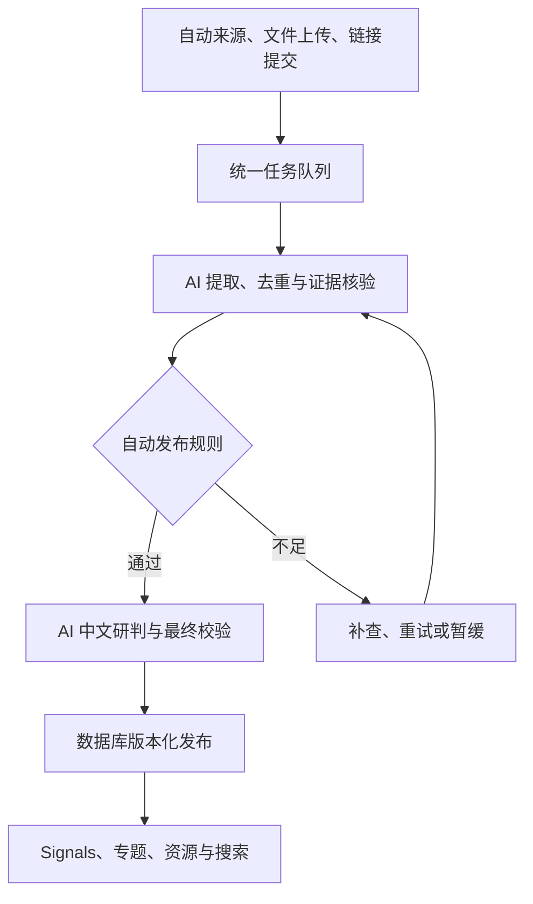

# HZense — 产品与系统设计文档

## HZense · Technology Intelligence

**版本：** v1.4  
**日期：** 2026-09-12  
**品牌：** HZense  
**品牌定位：** Technology Intelligence  
**品牌标语：** Sense what matters in technology.  
**官方域名：** `hzense.com`  
**Canonical URL：** `https://hzense.com`  
**文档类型：** 产品设计 / 信息架构 / 系统设计 / 实施规划

---

## 1. 项目定位

HZense 不是传统博客，也不是简单的收藏网站，而是一套面向长期技术研究、信息积累和趋势判断的个人技术情报平台。

核心链路：

> **Signals → Knowledge → Insights → Intelligence**

系统聚合并关联技术洞察、每日技术洞察简报、每周好文、科技信息解读、论文、公司与产品动态、人物与机构、技术资源、融资并购、政策变化和技术信号。

## 2. 核心能力

- **Discover** — 发现值得关注的信息与早期信号。
- **Organize** — 结构化 Topic、Technology、Company、People、Institution、Product、Paper、Event 和 Signal。
- **Connect** — 建立实体与知识之间的关系，形成 Technology Intelligence Graph。
- **Understand** — 沉淀自己的技术判断和趋势分析。
- **Track** — 持续跟踪热度、成熟度、竞争格局、研究方向、人才、投资和政策变化。

## 3. 信息生产链

目标生产链（AI 自主 Signal 功能待实施）：



Signals 为 Daily、Weekly、Insights 和 Radar 提供证据，这些栏目不是依次自动生成的串行步骤。当前 Daily 仍采用确定性候选和人工发布流程；其他栏目自动生产另行实施。

三层信息模型：Signals → Knowledge → Insights，最终形成 Intelligence。

## 4. 产品与一级导航

- **Home** — 技术情报驾驶舱
- **HZense Daily** — 每日技术洞察简报
- **HZense Insights** — 深度技术洞察
- **HZense Topics** — 专题知识库
- **HZense Radar** — 技术雷达
- **HZense Weekly** — 每周精选
- **HZense Resources** — 人物 / 公司 / 机构 / 论文 / 技术
- **HZense Signals** — 最新技术信号
- **Search / Ask HZense** — 全库搜索与 AI 技术情报问答

### 4.1 品牌与域名基线

HZense 的正式对外主域名为：

```text
hzense.com
```

生产环境统一使用：

```text
https://hzense.com
```

`hzense.com` 作为唯一 Canonical Domain。未来 `www.hzense.com` 应重定向至根域名，预览环境和临时部署地址不得作为搜索引擎 Canonical URL。

正式产品路径规划：

```text
https://hzense.com/             Home
https://hzense.com/daily        HZense Daily
https://hzense.com/weekly       HZense Weekly
https://hzense.com/signals      HZense Signals
https://hzense.com/insights     HZense Insights
https://hzense.com/topics       HZense Topics
https://hzense.com/radar        HZense Radar
https://hzense.com/resources    HZense Resources
https://hzense.com/ask          Ask HZense
```

当前状态：域名、网站部署、DNS、HTTPS、`www` 重定向与主要公开路由均已上线；Runtime Reader 数据库路径也已完成功能/配置生产验收。

## 5. Home

首页定位为 Technology Intelligence Dashboard，突出 Today's Intelligence、Technology Radar、Latest Insights、Latest Signals、Weekly Picks 和 Trending Topics。

## 6. HZense Daily

Daily 是日常最高频情报入口，不是新闻摘要，而是当天 Signals 经过筛选、去重、关联和研判后形成的技术情报产品。

固定结构：今日必看 Top 5、AI & Compute、Cybersecurity、Semiconductors、Robotics & Physical AI、Research Watch、Company & Capital、Signals to Watch、My Intelligence Take、Related Topics。

历史按日期归档，正式发布后作为 Markdown 知识资产进入 Git。

## 7. HZense Insights

用于技术洞察、趋势分析、产业分析、技术路线、公司分析和专题报告。单篇结构包括 Summary、Key Takeaways、My View、Evidence、Related Signals / Companies / People / Technologies / Papers、Timeline 和 Sources。

## 8. HZense Topics

Topic 是核心组织单元。首批一级领域包括 Artificial Intelligence、Cybersecurity、Semiconductors、Robotics、Quantum、Cloud & Infrastructure、Autonomous Systems、Energy Technology、Space Technology、Biotechnology。

Topic 页面包含 Overview、My View、Attention、Trend、Maturity、Strategic Value、Key Problems、Key Players、Key People、Research、Signals、Insights 和 Timeline。

## 9. HZense Weekly

每周从 Daily + Signals 中提炼高价值内容和趋势。每篇精选保存 Source、Author、URL、Why Read、Key Points、My View、Importance 和实体关联。

## 10. Briefings

用于 5–10 分钟理解新技术、产品发布、公司事件和产业变化。

## 11. HZense Signals

Signal 是最小情报单元。类型包括 Research、Product、Funding、Acquisition、Hiring、Policy、Technology、Market、People、Open Source、Security、Patent，实际枚举以信息模型为准。

目标 Signal 保存事实摘要、证据、事件日期及精度、采集/发布时间、领域和实体关联，并提供“为什么重要、影响对象、历史关系、后续观察、不确定性”的 AI 中文研判。事实与推断分开呈现，公开版本可追溯到模型、配置和证据；更正与撤回保留修订记录。

当前页面仍读取 Seed 中 reviewed/accepted 内容。目标版本采用数据库显式 published 状态；迁移保留原 ID 和引用，不把历史内容标为新 AI 已核验。

## 12. HZense Resources

核心实体：Person、Company、Institution、Technology、Product、Model、Dataset、Standard / Protocol、Paper、Event。所有实体与 Topic、Signal、Insight 双向关联。

Paper 是客观论文实体；HZense 对论文的摘要、解读和判断以 PaperNote 内容独立保存。

## 13. HZense Radar

核心指标：Attention Score 0–100、Trend、Maturity、Strategic Value，并保存历史快照用于趋势变化分析。

## 14. Intelligence Graph

关系模型示例：Person → works_at → Company；Company → develops → Technology；Model → trained_on → Dataset；Model → evaluated_on → Dataset；Product → uses → Model；Technology → implements → Standard / Protocol；Paper → presented_at → Event；Signal → affects → Topic；Insight → supported_by → Signal。

## 15. Timeline

Topic、Company、Technology、Person、Product、Model 和 Event 支持时间线，并逐步从 Signals 自动生成。

## 16. Search / Ask HZense

全文搜索覆盖 Topic、Insight、Signal、Company、Person、Institution、Technology、Product、Model、Dataset、Standard / Protocol、Paper 和 Event。Ask HZense 后续基于 Hybrid Retrieval + RAG 回答，并提供来源引用。

## 17. 内容与数据原则

网站是 Presentation Layer，Knowledge Base 才是核心资产。Daily、Weekly、Insights 等现有正文继续使用 Markdown / MDX + YAML Front Matter。

AI 自主 Signal 的目标权威边界：PostgreSQL 保存 Signal、证据、研判、版本与任务；Git 保存代码、Taxonomy 和基线策略；管理员网页编辑的模型、来源及任务配置在数据库版本化保存。原始文件默认私有对象存储，Markdown/YAML 导出用于迁移和备份。实施前 Signal 仍以 Seed 为准，切换后停止双写。

发布事务写入内容版本与 Outbox，再可靠更新搜索和缓存，无需逐条内容 PR 或重新部署。公共读取仅允许公开版本；索引延迟时仍须阻止撤回内容被返回。

所有对象使用稳定唯一 ID，标题变化不能改变 ID。

## 18. 内容状态与重要度

现有文章状态：Draft / Review / Published / Archived。Topic 增加 Watching / Active / Strategic。重要度统一 1–5 星。

目标 Signal 状态：Unpublished / Published / Withdrawn / Archived；候选和任务另有处理状态、重试及暂缓原因。模型评分记录为估计，不单独决定发布。

## 19. AI 自主采集与研判

本节是产品级设计入口，完整数据模型、接口建议、调度语义和验收见 [AI 自主 Signal 专项设计](AUTONOMOUS_SIGNAL_PIPELINE.md)。

### 19.1 自动内容发布原则

按用户 2026-09-12 的要求，Signal 不再以人工确认作为目标发布前置：系统自动采集、核验证据、研判、校验并发表。证据不足自动补查或暂缓，不进入必经人工审批队列；人工撤回是可选管理能力。此目标替代旧版 Signal 的人工审核原则，但不表示现有代码已切换，也不改变工程 PR、迁移权限和现有 Daily 发布门禁。

所有核心事实有可定位证据，来源独立性按原始出处判断；官方公告可支持有归属的发布事实，不能直接证明性能或影响结论。争议事件补充独立来源及相关方立场。模型之间达成一致不等于事实成立。关键数字、日期、引用、隐私和事件身份由规则及 AI 核验共同检查。

### 19.2 管理后台

| 功能       | 产品要求                                                        |
| ---------- | --------------------------------------------------------------- |
| AI 配置    | 服务商/兼容协议、API 地址、密钥、模型列表或手填、连接及能力测试 |
| 阶段模型   | 提取、核验、研判分别绑定模型、提示词与版本；配置预算和重试      |
| 来源管理   | 十领域映射、语言、来源身份、采集方式、游标和频率                |
| 任务管理   | 立即运行、定时、暂停/恢复、停止本次运行、失败重试               |
| 文件与链接 | 批量导入、解析预览、逐项结果及可追溯位置                        |
| 运行记录   | 进度、发布数、暂缓原因、token/费用、更正和审计                  |

后台 owner-only，全部 API 服务端鉴权。密钥加密保存、仅后台使用、界面掩码展示。自定义 API 地址及采集链接实施出口校验；模型不可执行任意 SQL 或把输入资料当系统指令。

### 19.3 三种入口与调度

自动来源、文件上传和链接提交使用相同流水线。文件支持 PDF、DOCX、Markdown、TXT、HTML、CSV/XLSX，扫描件与图片走 OCR。保留文件页码/段落/单元格位置；一文多事件和多文同事件都须正确处理。原文件默认私有，自动补齐公开证据后发表可公开内容。

手动和定时任务共用持久化执行器。支持间隔、每日、每周和 cron，默认 Europe/Berlin，显示后续运行时间并处理夏令时。关闭网页不影响执行；运行使用配置快照、租约与幂等键，停止任务不删除已发布内容。

### 19.4 分阶段交付

A：管理员认证、数据契约与 AI 配置；B：来源/文件/链接导入与手动运行；C：AI 核验研判；D：数据库发布及搜索/缓存；E：定时、预算、自动更正与监控。默认自动发布，可选择仅预览测试。上线验收需跑通三类入口的无人审核闭环；配置页面完成不等于整个系统已上线。

## 20. 视觉设计

方向：SemiAnalysis × Bloomberg Terminal × Notion × Technology Research Institute，但降低 Bloomberg 的信息密度。PC 偏研究工作台，Mobile 偏 Daily、Signals、Weekly 和阅读。

## 21. 实施路线

### Phase 0A — 技术架构与品牌基线

- [x] HZense 品牌确定
- [x] `hzense.com` 官方域名注册
- [x] 产品信息架构
- [x] 首版技术架构设计

### Phase 0B — Schema / Taxonomy

- [x] Information Model
- [x] Taxonomy
- [x] Entity / Relation Schema
- [x] Machine-readable Schema
- [x] Executable Front Matter Validation
- [x] Physical Database Schema / Migrations
- [x] Repository Skeleton

### Phase 1 — Knowledge Base

- [x] Insights
- [x] Daily
- [x] Weekly
- [ ] Briefings
- [x] Topics
- [x] Signals
- [x] Entities / Relations

### Phase 2 — Website MVP

- [x] Home
- [x] Daily
- [x] Insights
- [x] Topics
- [x] Weekly
- [x] Signals
- [x] Resources
- [x] Search
- [x] Responsive UI
- [x] Dark / Light Mode
- [x] Vercel Deployment
- [x] `hzense.com` DNS / Domain Binding

### Phase 3 — Radar

- [x] Attention / Trend / Maturity / Strategic Value
- [x] Historical snapshots

### Phase 4 — Timeline

- [ ] Entity timelines
- [ ] Signal-derived timeline

### Phase 5 — Intelligence Graph

- [ ] Entity Relation Model
- [ ] Graph Visualization

### Phase 6 — Ask HZense

- [x] FTS（FTS-1 已完成生产切换，证据见进度看板）
- [ ] Embeddings / pgvector
- [ ] Hybrid Search
- [ ] RAG
- [ ] Citations

### Phase 7 — Automated Ingestion

- [ ] RSS / arXiv / GitHub / Blogs / Company Sources / Newsletters
- [ ] Dedup / Classification / Entity Extraction / Ranking
- [x] AI 自主 Signal 总体与专项设计（PR #64，待合并；不代表功能实现）
- [ ] 管理员认证、AI 网页配置和版本化策略
- [ ] 文件/OCR 与批量链接导入、手动任务
- [ ] AI 证据核验、中文研判、机器发布规则
- [ ] Signal 数据库迁移、自动发表、搜索/缓存同步
- [ ] 时区调度、预算、重试、自动更正和监控

### Phase 8 — Intelligence Automation

- [x] Daily candidate generation
- [ ] Weekly candidate generation
- [ ] Topic updates
- [ ] Radar recommendations
- [ ] Emerging Topic Detection
- [ ] Weekly / Monthly Intelligence Reports

## 22. 推荐实施顺序

网站 MVP 与 FTS-1 已完成。下一阶段优先执行 **AI 自主 Signal：后台配置 → 三类采集入口 → AI 核验研判 → 数据库发布 → 定时及运营验收**，再扩展 Daily/Weekly 自动发表、混合搜索/RAG、时间线与图谱。

上述为开发顺序，不按文档提交增加完成百分比。当前实现和生产证据以 [进度看板](PROGRESS.md) 为准。

## 23. 最终目标

HZense 最终不是“保存写过什么”的静态网站，而是能够持续回答：一个技术方向发生了什么、谁最重要、哪些信号正在变成趋势、自己的判断如何变化、下一步值得关注什么。

> **HZense — Sense what matters in technology.**

---

## v1.4 AI 自主 Signal 整合（2026-09-12）

- 整合网页 AI 配置、三类入口、手动与定时任务、自动核验研判及发布。
- 明确 Signal 数据库权威、状态迁移、私有原件、公开证据及可追溯更正。
- 以自动规则替代目标 Signal 的必经人工审核；保留当前 Daily 与工程发布边界。
- 同步实施路线与进度入口，设计完成不计作功能上线。

## v1.3 域名基线更新

- 正式主域名锁定为 **hzense.com**。
- Canonical Production URL 锁定为 **https://hzense.com**。
- 产品公共路径统一规划为 `/daily`、`/weekly`、`/signals`、`/insights`、`/topics`、`/radar`、`/resources` 和 `/ask`。
- 首次 MVP 部署后绑定 Vercel，并将 `www.hzense.com` 重定向到根域名。
- 同步更新 Information Model v2.0.0 的证据契约、十类 Entity 表述与项目实施状态。

## v1.2 品牌基线更新

- 正式品牌名锁定为 **HZense**。
- 品牌定位：**Technology Intelligence**。
- 品牌标语：**Sense what matters in technology.**
- 产品模块统一命名为 HZense Daily / Weekly / Signals / Insights / Topics / Radar / Resources / Ask HZense。
- 核心方法论保持：**Signals → Knowledge → Insights → Intelligence**。
